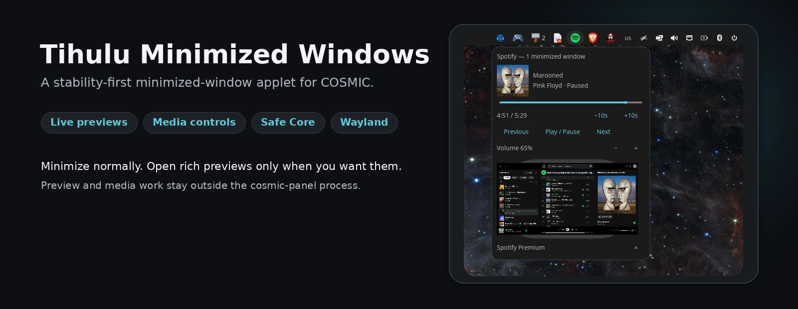
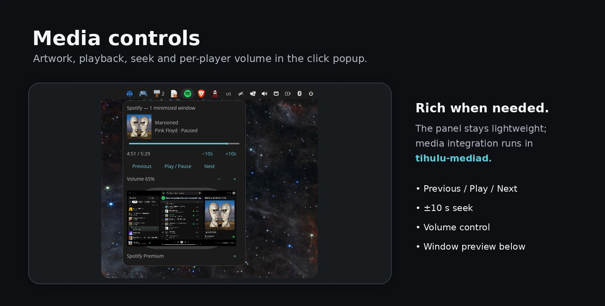
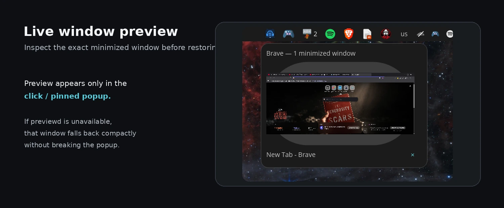
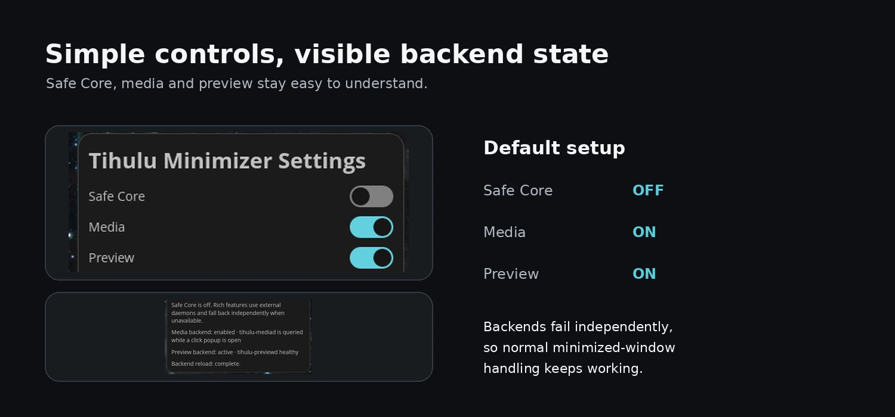
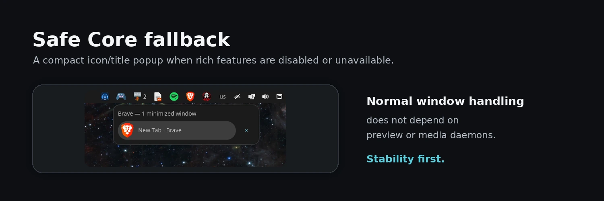

<p align="center">
  
</p>

<p align="center">
  <strong>Pop!_OS 24.04 · COSMIC · Wayland</strong><br>
  Lightweight minimized-window handling with optional live previews and media controls.
</p>

## Install

```bash
curl -fsSL https://raw.githubusercontent.com/Tihulu/tihulu-cosmic-minimized-windows/stable/scripts/quick-install.sh | bash
```

Then open **COSMIC Settings → Desktop → Dock/Panel**, remove the stock **Minimized Windows** applet if necessary, and add **Tihulu Minimized Windows**.

## What it does

- groups minimized windows under one panel/dock icon per application
- restores or closes the exact selected window
- shows live minimized-window previews in the click popup
- adds media metadata, artwork, playback controls and a draggable seek bar
- provides per-player volume controls
- supports browser volume through the PipeWire-Pulse app stream when MPRIS volume is ineffective
- falls back to a compact Safe Core popup when rich features are disabled or unavailable
- keeps preview/media work outside the `cosmic-panel` process

## Media controls

<p align="center">
  
</p>

Media integration is handled by `tihulu-mediad`, not by the panel process. The popup can expose artwork, playback actions, seek controls, volume and the minimized-window preview together.

## Live window preview

<p align="center">
  
</p>

Preview capture is handled by `tihulu-previewd`. If capture is unavailable for a window, that window falls back compactly without breaking the rest of the popup.

## Settings

<p align="center">
  
</p>

Clean installs use:

- **Safe Core:** OFF
- **Media:** ON
- **Preview:** ON

Optional backends fail independently, so normal minimized-window handling remains available.

## Safe Core

<p align="center">
  
</p>

Safe Core keeps the interaction compact: application icon, window title, restore and close — without depending on preview or media helpers.

## Architecture

```text
tihulu-cosmic-minimized-windows
    lightweight COSMIC panel UI
            |
            +-- IPC --> tihulu-previewd
            |
            +-- IPC --> tihulu-mediad
```

`tihulu-previewd` owns preview capture work. `tihulu-mediad` owns MPRIS/D-Bus media integration and browser audio-stream volume handling. The panel process itself does not perform MPRIS or PipeWire/Pulse audio-control work.

## Requirements

- Pop!_OS 24.04
- COSMIC desktop
- Wayland session
- systemd user services for the optional preview/media helpers

The project is built against pinned COSMIC/libcosmic protocol revisions. Other desktop environments and older Pop!_OS releases are not currently supported.

## Stability policy

Panel stability takes priority over rich features. Behavior-changing releases are not promoted to `stable` on CI alone: they are tested in a real COSMIC session and must keep `cosmic-panel` stable with bounded resource usage.

In particular:

- no popup auto-reopen/watchdog churn
- preview failure falls back only for the affected window
- media-daemon failure hides media controls without breaking the window popup
- preview/media helpers use bounded IPC/resource behavior

## Development

```bash
cargo fmt --all -- --check
cargo check --all-targets
cargo test --all-targets
cargo clippy --all-targets -- -D warnings
cargo build --release
```

## License

AGPL-3.0-only. See `LICENSE`.

This is a separate implementation for COSMIC interoperability and does not include System76's `cosmic-applet-minimize` source files.
