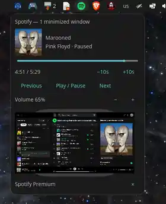
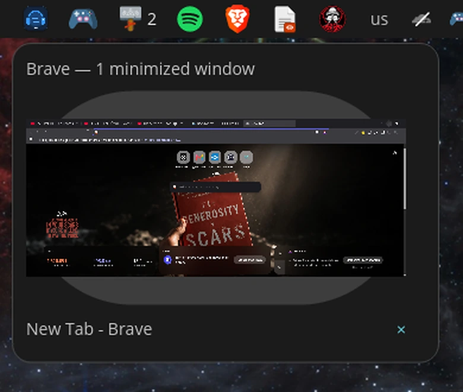
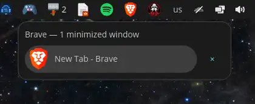

# Tihulu Minimized Windows

<p align="center">
  A stability-first minimized-window applet for the <strong>COSMIC desktop</strong>.
</p>

<p align="center">
  
  
  
  
</p>

<p align="center">
  <strong>Pop!_OS 24.04 · COSMIC · Wayland</strong>
</p>

<p align="center">
  
</p>

<p align="center">
  Lightweight minimized-window handling with optional live previews and media controls through isolated helper daemons.
</p>

<p align="center">
  <a href="#quick-install">Quick Install</a> ·
  <a href="#features">Features</a> ·
  <a href="#media-controls">Media</a> ·
  <a href="#live-window-preview">Preview</a> ·
  <a href="#architecture">Architecture</a> ·
  <a href="#stability-policy">Stability</a>
</p>

## Quick Install

<table>
<tr>
<td>
<strong>Install from the stable branch</strong><br><br>

<pre><code>curl -fsSL https://raw.githubusercontent.com/Tihulu/tihulu-cosmic-minimized-windows/stable/scripts/quick-install.sh | bash</code></pre>

Then open <strong>COSMIC Settings → Desktop → Dock/Panel</strong>, remove the stock <strong>Minimized Windows</strong> applet if necessary, and add <strong>Tihulu Minimized Windows</strong>.
</td>
</tr>
</table>

## Features

<table>
<tr>
<td width="50%" valign="top">
<strong>Window workflow</strong><br><br>
• grouped minimized windows per application<br>
• exact-window restore and close<br>
• live preview in the click popup<br>
• horizontal and vertical panel/dock support
</td>
<td width="50%" valign="top">
<strong>Rich features without panel bloat</strong><br><br>
• artwork, playback and draggable seek<br>
• per-player volume controls<br>
• browser volume fallback through PipeWire-Pulse<br>
• Safe Core compact fallback
</td>
</tr>
</table>

Preview and media work stay outside the `cosmic-panel` process.

## Media controls

<table>
<tr>
<td width="58%" align="center" valign="middle">
  
</td>
<td width="42%" valign="middle">
  <strong>Media without making the panel heavy</strong><br><br>
  Artwork, playback actions, seek and per-player volume are available directly from the click popup.<br><br>
  Media integration runs in <code>tihulu-mediad</code>, keeping MPRIS/D-Bus and browser audio-stream handling outside <code>cosmic-panel</code>.
</td>
</tr>
</table>

## Live window preview

<table>
<tr>
<td width="42%" valign="middle">
  <strong>Know which window you are restoring</strong><br><br>
  The popup can show a captured preview of the exact minimized window before you restore it.<br><br>
  Capture runs in <code>tihulu-previewd</code>. If preview is unavailable for one window, only that window falls back compactly.
</td>
<td width="58%" align="center" valign="middle">
  
</td>
</tr>
</table>

> A real short COSMIC screen recording can be added here later as a demo GIF. The README intentionally avoids generated or reconstructed UI.

## Settings and backend status

<table>
<tr>
<td width="52%" align="center" valign="middle">
  
</td>
<td width="48%" valign="middle">
  <strong>Simple defaults</strong><br><br>
  <strong>Safe Core:</strong> OFF<br>
  <strong>Media:</strong> ON<br>
  <strong>Preview:</strong> ON<br><br>
  Backend state is visible from the settings popup. The normal interaction model is click/right-click with a pinned popup; there is no hover-preview path.
</td>
</tr>
</table>

## Safe Core

<table>
<tr>
<td width="42%" valign="middle">
  <strong>Compact fallback when rich features are unavailable</strong><br><br>
  Safe Core keeps normal window restore and close available without depending on preview or media helpers.<br><br>
  A failure in one optional backend does not break the normal minimized-window popup.
</td>
<td width="58%" align="center" valign="middle">
  
</td>
</tr>
</table>

## Architecture

The panel applet is intentionally kept small. Rich features run in separate processes:

```text
tihulu-cosmic-minimized-windows
    lightweight COSMIC panel UI
            |
            +-- IPC --> tihulu-previewd
            |
            +-- IPC --> tihulu-mediad
```

`tihulu-previewd` owns preview capture work. `tihulu-mediad` owns MPRIS/D-Bus media integration and browser audio-stream volume handling. The panel process itself does not perform MPRIS or PipeWire/Pulse audio-control work.

If either optional backend is unavailable, the affected rich feature falls back independently instead of breaking the normal minimized-window popup.

## Requirements

Supported target environment:

- Pop!_OS 24.04
- COSMIC desktop
- Wayland session
- systemd user services for the optional preview/media daemons

The project is built against pinned COSMIC/libcosmic protocol revisions. Other desktop environments and older Pop!_OS releases are not currently supported.

## Stability policy

The project prioritizes panel stability over rich features. Behavior-changing releases are not promoted to `stable` on CI alone: they are tested in a real COSMIC session and must keep `cosmic-panel` stable with bounded resource usage.

In particular:

- no popup auto-reopen/watchdog churn
- preview failure falls back only for the affected window
- media-daemon failure hides media controls without breaking the window popup
- preview/media helpers use bounded IPC/resource behavior

## Development

```bash
cargo fmt --all -- --check
cargo check --all-targets
cargo test --all-targets
cargo clippy --all-targets -- -D warnings
cargo build --release
```

## License

AGPL-3.0-only. See `LICENSE`.

This is a separate implementation for COSMIC interoperability and does not include System76's `cosmic-applet-minimize` source files.
